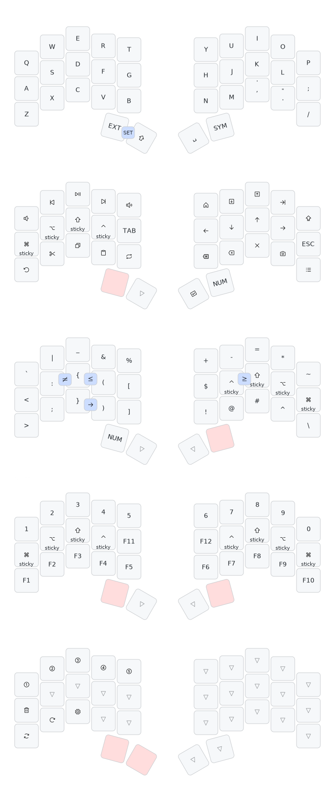

# Urchin ZMK Firmware

ZMK firmware build environment for the [Urchin Keyboard](https://github.com/duckyb/urchin).

## Quick Start

### Prerequisites

- [uv](https://docs.astral.sh/uv/) (recommended) or Python 3.12+
- Homebrew (for macOS dependencies)

### Setup & Build

1. **Install system dependencies:**
   ```bash
   brew install dtc
   ```

2. **Install Python dependencies:**
   ```bash
   # With uv (recommended)
   uv sync
   
   # Or with pip
   pip install -r requirements.txt
   ```

3. **Build firmware:**
   ```bash
   ./build.sh
   ```

The build script will:
- Set up the ZMK/Zephyr build environment
- Download the Zephyr SDK (first run only)
- Build firmware for left half, right half, and settings reset

### Firmware Files

After building, you'll find the firmware files in:
- **Left half**: `build/left/zephyr/zmk.uf2`
- **Right half**: `build/right/zephyr/zmk.uf2`
- **Settings reset**: `build/reset/zephyr/zmk.uf2`

### Flashing

1. Put your Nice!Nano into bootloader mode (double-tap reset)
2. Copy the appropriate `.uf2` file to the mounted drive
3. The board will reboot with the new firmware

## Development

The build script automatically detects and uses `uv` if available, falling back to system Python packages otherwise.

### Using uv commands directly:

```bash
# Initialize workspace
uv run west init -l config/

# Update dependencies  
uv run west update

# Build specific target
uv run west build -s zmk/app -d build/left -b nice_nano_v2 -- -DSHIELD="urchin_left nice_view_adapter nice_view_gem" -DZMK_CONFIG="$PWD/config"

# Generate keymap visualization
uv run keymap -c keymap_drawer.config.yaml parse -z config/urchin.keymap -c 10 > urchin_keymap.yaml
uv run keymap -c keymap_drawer.config.yaml draw urchin_keymap.yaml > urchin_keymap.svg
```

## Project Structure

- `config/` - ZMK configuration files (keymap, config)
- `build.sh` - Main build script
- `pyproject.toml` - Python dependencies and project metadata
- `zephyr-sdk-0.16.8/` - Zephyr SDK (downloaded on first build)

## Keymap

The keymap is configured in `config/urchin.keymap`. This layout is optimized for Italian keyboard input and features:

- Base QWERTY layer
- Symbol layer with programming symbols
- Number pad layer
- Extension layer with navigation and function keys



### Generate Keymap Visualization

You can regenerate the keymap visualization using:

```bash
./draw.sh
```

This will create:
- `urchin_keymap.svg` - All layers combined
- `urchin_keymap_base.svg` - Base layer only  
- `urchin_keymap_ext.svg` - Extension layer only
- `urchin_keymap_sym.svg` - Symbol layer only
- `urchin_keymap_num.svg` - Number layer only

## Troubleshooting

### Build Issues

- **Missing dtc**: Install with `brew install dtc`
- **Python package issues**: Try `uv sync --reinstall` or check Python version
- **West command not found**: Run `uv sync` to install dependencies

### Clean Build

```bash
rm -rf build/ .west/
./build.sh
```

This will reinitialize the entire build environment.